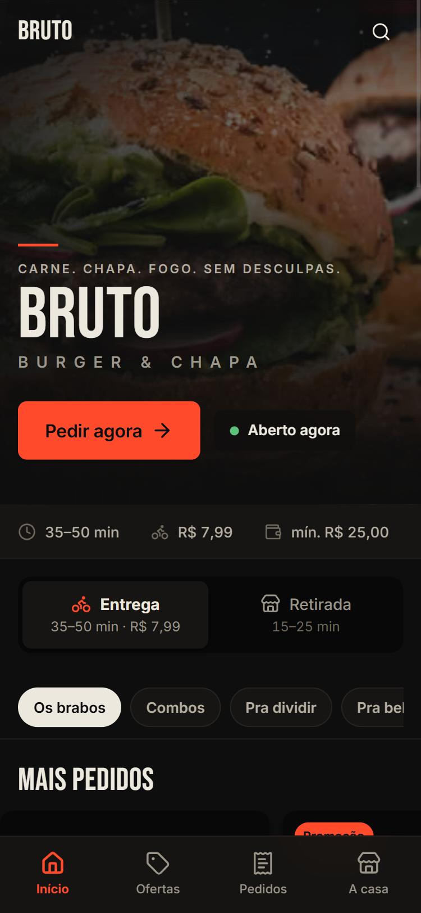
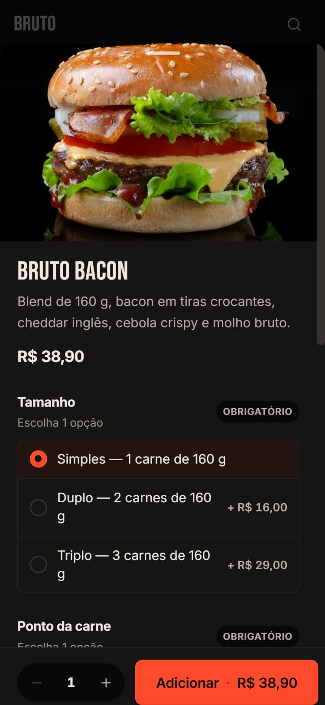
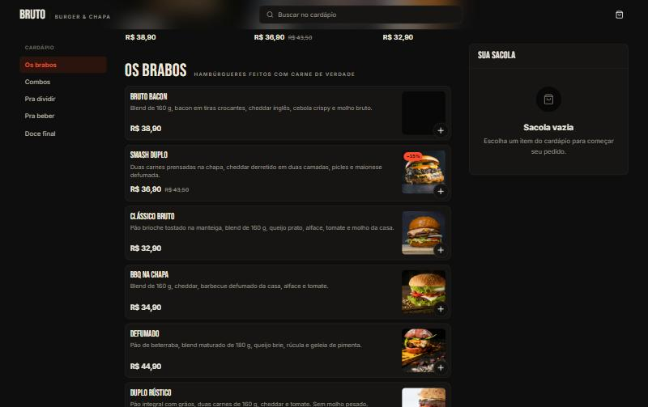
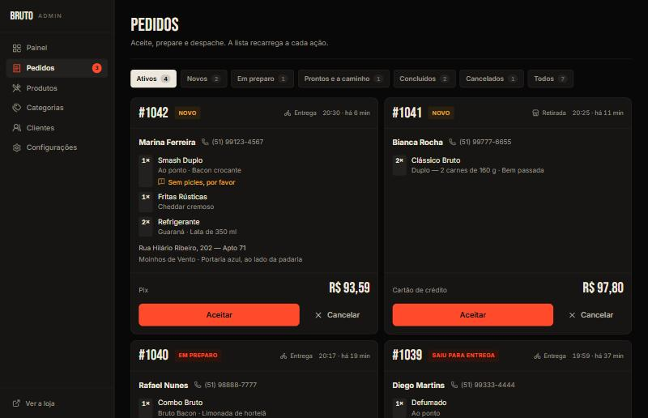

<div align="center">

# BRUTO — Burger & Chapa

**Carne. Chapa. Fogo. Sem desculpas.**

Plataforma de pedidos online para hamburgueria, construída como produto —
não como exercício. Loja digital para o cliente, painel de operação para a
cozinha, e uma arquitetura multi-loja por baixo.

`Next.js 16` · `TypeScript` · `Tailwind v4` · `PostgreSQL` · `Zod`

</div>

---

<table>
<tr>
<td width="50%"></td>
<td width="50%"></td>
</tr>
</table>





---

## O que é

Duas experiências em cima da mesma base.

**Para quem pede:** entra, escolhe, personaliza, paga e acompanha. Do cardápio
ao pedido confirmado sem criar conta e sem aprender a usar nada.

**Para quem vende:** um painel que responde "quantos pedidos hoje", "o que
está parado esperando" e "o que mais saiu" — e deixa aceitar, preparar,
despachar e esgotar item em um toque.

A marca é a BRUTO. A arquitetura é multi-loja: toda tabela carrega `store_id`,
o tema entra por variável CSS num ponto só, e a rota do admin já é por loja.
Servir um segundo cliente não pede reescrita — pede cadastro.

> **A regra que orienta o projeto:** a arquitetura é reutilizável, a
> experiência visual é específica da BRUTO. Flexibilidade não pode custar
> personalidade.

## Rodando

```bash
npm install
npm run dev     # http://localhost:3000
```

Sem banco, sem variável de ambiente, sem conta em lugar nenhum: o produto
inteiro roda sobre um seed em memória com o cardápio, os clientes e os pedidos
da BRUTO já povoados.

---

## Decisões que valem a leitura

Estas são as escolhas que separam um protótipo de algo que aguenta um
restaurante de verdade.

### O navegador nunca escolhe o preço

O checkout envia apenas ids de produto e de opção. O servidor recalcula todo o
valor contra o catálogo antes de gravar, e recusa loja fechada, item
indisponível, opção que não pertence ao produto e troco menor que o total.

Por isso a migration **não** cria policy de `insert` em `orders`: deixar o
cliente inserir pedido é deixar o cliente decidir quanto pagar.

### Pedido é imutável

`order_items` guarda nome, imagem e preço do momento da compra; as opções
guardam rótulo e acréscimo. Mudar o cardápio amanhã não reescreve o pedido de
ontem — e o ranking de "mais pedidos" continua correto mesmo para produto que
saiu do cardápio.

### Variação e adicional são a mesma coisa

Um grupo de opções com `min_select` e `max_select` cobre os dois casos:
`1..1` vira escolha obrigatória (tamanho, ponto da carne), `0..N` vira
adicional. Uma tabela, uma regra de validação, uma tela.

### Um contrato de dados, duas implementações

A interface fala com `DataSource` e nunca com o banco direto. Sem credenciais
de Supabase, roda sobre o seed em memória; com as variáveis definidas, fala com
Postgres. Nenhuma tela sabe a diferença — e dá para construir interface sem
depender de infraestrutura.

### O carrinho é um store externo, não estado de efeito

Ele vive no `localStorage`, que é externo ao React, então é lido por
`useSyncExternalStore`. Isso elimina divergência entre o HTML do servidor e o
do cliente, sincroniza duas abas da mesma loja de graça e evita render em
cascata na montagem.

### Multi-tenant no banco, não na aplicação

RLS ligada em todas as tabelas desde a primeira migration. Leitura de catálogo
é pública por policy explícita; escrita exige vínculo em `store_users`.
Esquecer um `where store_id = ...` no código não vaza dado de outra loja.

### A numeração do pedido não corre risco

Um contador por loja, atualizado em trigger, em vez de `max(number) + 1` — que
sob concorrência entrega o mesmo número para dois pedidos numa sexta à noite.

---

## Design

Preto de carvão, texto cor de osso, um único vermelho para ação. A comida é a
única fonte de cor viva; a interface recua para a fotografia trabalhar.

| Token | Valor | Uso |
| --- | --- | --- |
| `--color-paper` | `#0e0e0e` | Fundo |
| `--color-surface` | `#161513` | Cards e painéis |
| `--color-ink` | `#ede8de` | Texto |
| `--color-brand` | `#ff4b2b` | Ação, seleção, foco |

**Bebas Neue** para display e **Inter** para corpo. Bebas só tem caixa alta e
um peso, então a hierarquia vem de corpo e entreletra — por isso
`.font-display` fixa isso num lugar só.

A assinatura da marca é tipográfica: o nome em condensada, a linha
`BURGER & CHAPA` espaçada embaixo e um risco vermelho curto. Sem ícone de
hambúrguer, sem chama, sem garfo e faca.

**Contraste conferido no navegador**, não estimado: texto principal 14,9:1,
secundário 6,1:1, vermelho sobre preto 5,8:1. Todos acima de AA.

### Mobile não é o desktop reduzido

Lista vertical com informação à esquerda e foto à direita — a leitura natural
em português, e o preço fica numa coluna só, fácil de varrer. O `+` sobre a
foto resolve em um toque o que não tem o que escolher, e abre a folha quando
tem opção: nunca se adiciona ao carrinho algo incompleto.

A sacola é barra flutuante que só existe quando há itens. Barra vazia
permanente rouba altura de tela em troca de nada.

No desktop, três colunas: navegação, cardápio e sacola persistente. Duas
colunas de produto só a partir de `2xl`, quando cada linha ainda tem largura
para duas frases de descrição.

### Detalhes que ninguém nota — até faltarem

- Remover item do carrinho sempre vem com **desfazer**: é o erro mais caro ali
- Com a loja fechada, o bloqueio aparece **na sacola**, não depois de quatro
  etapas de checkout preenchidas
- Observação do cliente ganha destaque em âmbar no painel — é o que mais se
  perde na correria da cozinha
- O vídeo do hero só carrega em tela grande e com `prefers-reduced-motion`
  liberado; no celular fica a foto, porque são quase 3 MB
- A foto de produto tem queda suave: loja real tem item sem imagem

---

## Stack

| Camada | Escolha | Por quê |
| --- | --- | --- |
| Framework | Next.js 16 (App Router) | Server Components por padrão — cardápio é conteúdo, não aplicação |
| Linguagem | TypeScript | Sem `any` no domínio |
| Estilo | Tailwind CSS v4 | Tokens em `@theme`, uma fonte de verdade |
| Validação | Zod | O mesmo schema no campo e na server action |
| Formulários | React Hook Form | Checkout em etapas sem re-render da árvore |
| Banco | PostgreSQL / Supabase | RLS resolve multi-tenancy no banco |

Interface: `lucide-react`, `vaul` (bottom sheet arrastável), `sonner`,
`@radix-ui/*`, `cva` + `tailwind-merge`.

## Arquitetura

```
src/
  domain/      Regras puras. Sem React, sem I/O.
  server/
    data/      Acesso a dados atrás de um contrato
    actions/   Server actions
  components/
    ui/        Primitivas
    store/     Experiência do cliente
    admin/     Operação da loja
supabase/
  migrations/  Esquema + RLS
```

## Banco

```bash
supabase db push
```

Depois, `getDataSource()` passa a falar com o Postgres sem tocar em tela:

```
NEXT_PUBLIC_SUPABASE_URL=
NEXT_PUBLIC_SUPABASE_ANON_KEY=
SUPABASE_SERVICE_ROLE_KEY=
```

A chave de serviço fica só no servidor, para o que o navegador não pode fazer:
gravar pedido com preço calculado no servidor e ler pedido de quem comprou sem
conta.

---

## Roadmap

- [ ] **Autenticação** — o modelo e a RLS já separam cliente de usuário da
      loja; falta a tela de login. Até lá o admin fica aberto a quem souber a
      URL: dá para demonstrar, não para entregar a um restaurante.
- [ ] **Validar o adaptador Supabase contra uma instância real** — o código
      está escrito e tipado contra o esquema das migrations, mas ainda não
      rodou num banco de verdade
- [ ] Criar e editar categoria pelo admin (produtos já são editáveis)
- [ ] Upload de imagem para o Supabase Storage

## Créditos

Fotos de produto: [Unsplash](https://unsplash.com), baixadas para o
repositório para o projeto rodar sem depender de rede. Vídeo de marca e
direção criativa: autoria do projeto.
